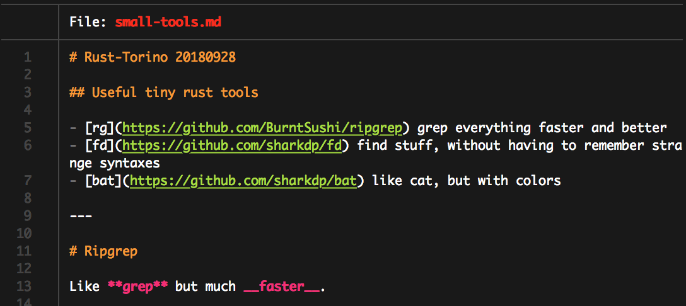

# Rust-Torino 20180928

## Useful tiny rust tools

- [rg](https://github.com/BurntSushi/ripgrep) grep everything faster and better
- [fd](https://github.com/sharkdp/fd) find stuff, without having to remember strange syntaxes
- [bat](https://github.com/sharkdp/bat) like cat, but with colors

---

# Ripgrep

Like **grep** but much __faster__.

### Simpler usage
``` sh
$ rg something
```
``` sh
$ grep something -r .
```
### Regexps everywhere
``` sh
$ rg 'foo\w+' -g '*.{c,h}'
$ rg 'some project' -g '!*.ninja'
```
### Shortcuts
``` sh
$ rg --type-list
$ rg foo --type-not js
$ rg foo --type rust
```

---
# fd-find

### Simpler usage
``` sh
$ fd rav1e
```
``` sh
$ find . -name rav1e
```
### Regexps again
``` sh
$ fd "^rav\d+e$"
```
### Filters
``` sh
# Exclude the vim while searching for hidden files
$ fd -H -E "*.sw(p|o)$"
# Search for EVERYTHING
$ fd -HI
# Search by extension
$ fd -e md
```
---
# bat
A better `cat`.

### Syntax highlight



It is git aware, has many themes and it uses sublime text format for the syntax highlighting.
